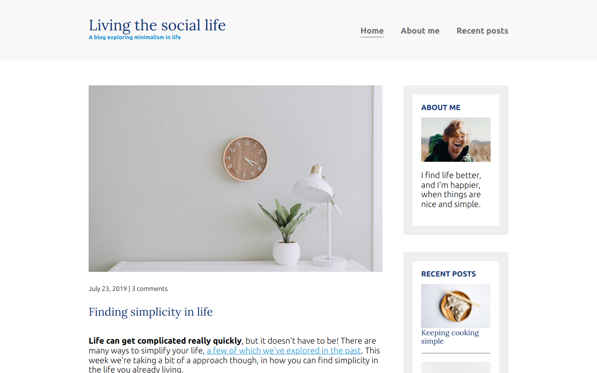

# LIVING THE SOCIAL LIFE

## Purpose

This project was developed as training in CSS responsive layout

</img>

## Built with

- HTML.
- Css (Responsive - Media Query)

## Link

- https://living-the-social-life.vercel.app/

## Available Scripts

**npm i** to install **npm start** to lunch on your localhost

Runs the app in the development mode.
Open http://localhost:3000 to view it in your browser.
